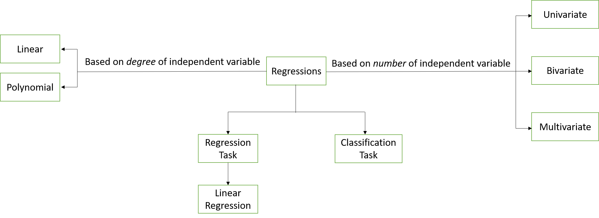
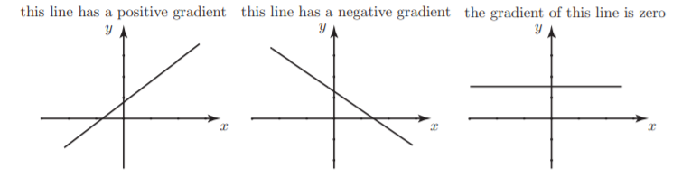
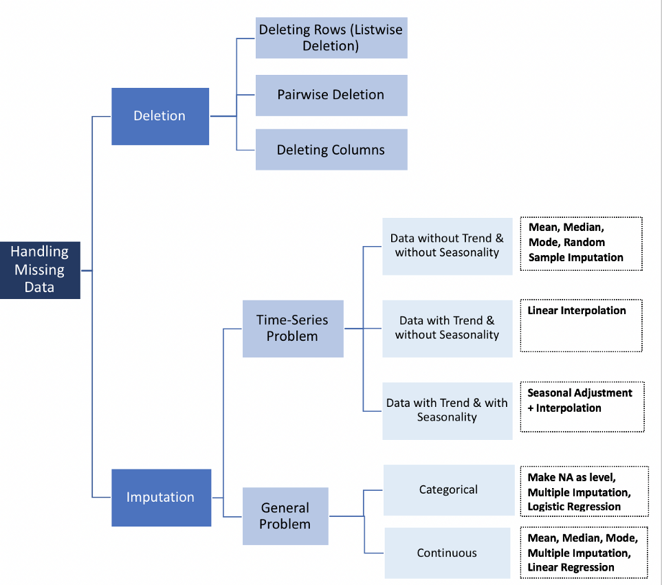

<style>
body {
text-align: justify}
</style>


```{r setup, include=FALSE}
# clear-up the environment
rm(list = ls())

# scientific notation
options(scipen = 9999)
```


<br>

# **Linear Regression** {.tabset .tabset-fade .tabset-pills}

## Concept {.tabset .tabset-fade .tabset-pills}

Regression is one of the most important concepts used in machine learning. 
Regression analysis allows us to predict target variable *(y)* based on the value of one or multiple predictor variables *(x)*. 
The target variable is also known as an independent variable or label. On the other hand, predictor variables are also known as dependent variables.

The types of regressions are represented in the diagram:

```{r out.width="100%", fig.align='center', echo=FALSE}

```


In the formula below you will find several notations, such as $y$, $b_0$, $b_n$, and $x_n$. Note that :

1. The target variable (independent variable) is denoted by $y$.
2. The predictor variables (dependent variables) are denoted by $x_n$. 
3. The intercept is denoted by $b_0$. 
4. The slope (gradient) values are denoted by $b_n$. The slope (gradient) value can have positive, negative or zero value. The slope (gradient) value need to be learnt.


```{r out.width="80%", fig.align='center', echo=FALSE}

```


<br>
Without further ado, let's talk in details about all the points shows in the block diagram!
<br>


### Based on:


<b><h3>A. Degree of independent variable</h3></b>


\noindent 1. Linear : the model fit to predict a target variable of the data is linear.

$$y = b_0 + b_1*x_1 + b_2*x_2 + b_3*x_3 + ... b_n*x_n$$


\noindent 2. Polynomial: the model fit to predict a target variable of the data is polynomial.

$$y = b_0 + (b_1*x_1)^1 + (b_2*x_2)^2 + (b_3*x_3)^3 + ... (b_n*x_n)^n$$


<b><h3>B. Number of independent variable</h3></b>


\noindent 1. Univariate : the number of target variable (independent variable) is 1.

$$y = b_0 + b_1*x_1$$


\noindent 2. Bivariate: the number of target variable (independent variable) is 2.

$$y = b_0 + b_1*x_1 + b_2*x_2$$

\noindent 2. Multivariate: the number of target variable (independent variable) is more than 2.

$$y = b_0 + b_1*x_1 + b_2*x_2 + b_3*x_3 + ... b_n*x_n$$

### Linear Regression


The focus of the regression task is to predict a value of the best fit model based on the independent variable(s). The linear regression tries to find out the best possible linear relationship between the target variable and the predictor variables.


Linear regression consists of finding the best-fitting straight line through the points. The best-fitting line consists of the predicted score on $Y$ for each possible value of $X$. The vertical lines from the points to the best-fitting represent the errors of prediction.

The error of prediction for a point is the value of the point $Y$ minus the predicted value $Y'$ (the value on the line).

$$ Error = Y - Y'$$

The most commonly-used criterion for the best-fitting line is the line that minimizes the sum of the squared errors of prediction ($(Y-Y')^2$).


## Limitations & Assumptions {.tabset .tabset-fade .tabset-pills}

### Limitations


Linear regression models, even when considered to be the powerhouse of statistics came with its limitations.

- Linear regressions are best fitted on data where a linear relationship between the predictor variables and target exist.
- Simple/multiple regression models can be sensitive to outliers (recall the chapter regarding leverage and power)


### Assumptions


Linear regression models, even when considered to be the powerhouse of statistics came with its assumptions.


\noindent 1. Linearity: There's a linear relationship between the target variable and the independet variable(s)

\noindent 2. Normality Error: The distribution of error is a normal distribution.

\noindent 3. Homoscedasticity: Error are randomly scattered

\noindent 4. Non-Multicolinearity: There are no independent variable that are strongly correlated with each other.


# **Packages Required**

Initially, we begin by loading the packages that will be required throughout the course of the analysis.

```{r results='hide', message=FALSE}

library(data.table)
library(DT)
library(kableExtra)
library(knitr)
library(tidyverse)
library(scales)
library(caret)
library(psych)
library(stats)
library(leaps)
library(GGally)
library(MASS)
library(lmtest)
library(car)
library(MLmetrics)
```


The descriptions of the packages are in the table below.

```{r echo=FALSE}
#Reading the library description csv File
pkg.desc <- read.csv("assets/desc.csv")

kable(pkg.desc) %>%
  kable_styling(bootstrap_options = c("striped", "hover", "condensed", "responsive")) %>% 
  scroll_box(height = "400px") %>% 
  kable_minimal()
```


# **Data Preparation** {.tabset .tabset-fade .tabset-pills}


Now, let's load the dataset into the R-Environment.

## Importing Data


> <h4>This project aims to build the best model that can predict the Life Expectancy based on he Global Health Observatory (GHO) dataset.</h4>


<b><h2>Data Source</h2></b>

This project uses the data from [Kumar Rajarshi - Life Expectancy (WHO)](https://www.kaggle.com/kumarajarshi/life-expectancy-who) in [kaggle.com](https://www.kaggle.com) website. The data was collected from WHO and United Nations website with the help of Deeksha Russell and Duan Wang.


[The Global Health Observatory (GHO) data repository](https://apps.who.int/gho/data/node.main.688) under World Health Organization (WHO) keeps track of the health status as well as many other related factors for all countries The data-sets are made available to public for the purpose of health data analysis. The data-set related to life expectancy, health factors for 193 countries has been collected from the same WHO data repository website and its corresponding economic data was collected from United Nation website. Among all categories of health-related factors only those critical factors were chosen which are more representative. It has been observed that in the past 15 years , there has been a huge development in health sector resulting in improvement of human mortality rates especially in the developing nations in comparison to the past 30 years. Therefore, in this project we have considered data from year 2000-2015 for 193 countries for further analysis. The individual data files have been merged together into a single data-set. 


<b><h2>Read the Data</h2></b>

The dataset is in `.csv` format, so we will use`read.csv` method to read the dataset.

```{r message=FALSE, error=FALSE, warning=FALSE}
raw.data <- read.csv("assets/Life Expectancy Data.csv")
```


<b><h2>Glimpse of the Data</h2></b>

After importing the dataset, Let's take a peek of our dataset! 

The dataset has **2,938 rows** and **22 columns**.


```{r}
# DATA INPUT: RAW DATASET
glimpse(raw.data)
```


## Data Wrangling {.tabset .tabset-fade .tabset-pills}

### Quality Check {.tabset .tabset-fade .tabset-pills}


#### Missing Values

Let's see how many missing values in each column.


```{r}
# Counting missing values in each column
numMissVal <-sapply(raw.data, function(x) sum(length(which(is.na(x)))))

# Result table
kable(as.data.frame(numMissVal)) %>%
  kable_styling(bootstrap_options = c("striped", "hover", "condensed", "responsive")) %>% 
  scroll_box(width = "100%", height = "250px")
```

<br>
**Observation findings :**

1. The majority of columns have missing values.


#### Duplicated Rows

There aren't any duplicated rows found.

```{r results="hide"}
# Check duplicated rows
raw.data[which(duplicated(raw.data) ==T), ]
```


### Data Formatting

Some columns need to be changed as factors.


```{r}
# data format : factor
raw.data$Country <- as.factor(raw.data$Country)
raw.data$Status <-  as.factor(raw.data$Status)
```


### NA Values Treatment {.tabset .tabset-fade .tabset-pills}

#### Concept

<br>
The missing value can severely distort the distribution of the data. However, there isn't any better way to deal with missing data. Removing columns or rows with missing values can produce a bias in the analysis. Note that imputation does not necessarily give better results. 

<br>
[Alvira Swalin](https://towardsdatascience.com/@aswalin) gave a better explanation about how to handle missing data in [towardsdatascience.com](https://towardsdatascience.com/how-to-handle-missing-data-8646b18db0d4). The methods to handle missing values are as follow:


```{r out.width="120%", fig.align='center', echo=FALSE}

```


<br>

_**Based on the previous flowchart, we use data imputation to deal with the general problem with continuous data type.**_


#### Check Outliers {.tabset .tabset-fade .tabset-pills}


According to the block diagram before, we can treat the missing values by using data imputation. The columns that have missing values are continuous data type. To treat the missing value, we can choose to treat it by imputing its mean value or its median value based on the outliers occurrences. If there are many outliers data, it'll be best to use the median value. On the other hand, if there aren't many outliers data, we can use the mean value.


```{r out.width="100%"}
par(mfrow=c(1,3))
boxplot(raw.data$Life.expectancy,
        ylab = "Life Expectancy",
        main = "Boxplot of Life Expectancy")
boxplot(raw.data$Adult.Mortality,
        ylab = "Adult Mortality",
        main = "Boxplot of Adult Mortality")
boxplot(raw.data$Alcohol,
        ylab = "Alcohol",
        main = "Boxplot of Alcohol")


par(mfrow=c(1,3))
boxplot(raw.data$Hepatitis.B,
        ylab = "Hepatitis B",
        main = "Boxplot of Hepatitis B")
boxplot(raw.data$BMI,
        ylab = "BMI",
        main = "Boxplot of BMI")
boxplot(raw.data$Polio,
        ylab = "Polio",
        main = "Boxplot of Polio")


par(mfrow=c(1,3))
boxplot(raw.data$Total.expenditure,
        ylab = "Total Expenditure",
        main = "Boxplot of Total Expenditure")
boxplot(raw.data$Diphtheria,
        ylab = "Diphteria",
        main = "Boxplot of Diphteria")
boxplot(raw.data$GDP,
        ylab = "GDP",
        main = "Boxplot of GDP")

par(mfrow=c(1,3))
boxplot(raw.data$Population,
        ylab = "Population",
        main = "Boxplot of Population")
boxplot(raw.data$thinness..1.19.years,
        ylab = "Thinness 1-19 years",
        main = "Boxplot of Thinness for 1-19 years old")
boxplot(raw.data$thinness.5.9.years,
        ylab = "Thinness 5-9 years",
        main = "Boxplot of Thinness for 5-9 years old")

par(mfrow=c(1,3))
boxplot(raw.data$Income.composition.of.resources,
        ylab = "Income Composition",
        main = "Boxplot of Income Composition")
boxplot(raw.data$Schooling,
        ylab = "Schooling",
        main = "Boxplot of Schooling")


```

<br>
**Observation findings :**

1. Most of the columns have many outliers, except `Alcohol`, `BMI`, `Income.composition.of.resources`.
2. We use its median value for the columns that have many outliers.
3. We use its mean value for the columns that not have many outliers.


#### Data Imputation


We use data imputation by its median value to most of the columns with missing values. These columns have many outliers.


```{r}
# Find median value 

life_mean <- median(raw.data$Life.expectancy,  na.rm = TRUE)
mortality_mean <- median(raw.data$Adult.Mortality,  na.rm = TRUE)
hepatitis_mean <- median(raw.data$Hepatitis.B,  na.rm = TRUE)
polio_mean <- median(raw.data$Polio,  na.rm = TRUE)
diph_mean <- median(raw.data$Diphtheria,  na.rm = TRUE)
exp_mean <- median(raw.data$Total.expenditure,  na.rm = TRUE)
gdp_mean <- median(raw.data$GDP,  na.rm = TRUE)
pop_mean <- median(raw.data$Population,  na.rm = TRUE)
thin19_mean <- median(raw.data$thinness..1.19.years,  na.rm = TRUE)
thin9_mean <- median(raw.data$thinness.5.9.years,  na.rm = TRUE)
school_mean <- median(raw.data$Schooling,  na.rm = TRUE)

```


Then replace the missing values with the median of the corresponding columns.

```{r}
raw.data$Life.expectancy[is.na(raw.data$Life.expectancy)] <- life_mean
raw.data$Adult.Mortality[is.na(raw.data$Adult.Mortality)] <- mortality_mean
raw.data$Hepatitis.B[is.na(raw.data$Hepatitis.B)] <- hepatitis_mean
raw.data$Polio[is.na(raw.data$Polio)] <- polio_mean
raw.data$Diphtheria[is.na(raw.data$Diphtheria)] <- diph_mean
raw.data$Total.expenditure[is.na(raw.data$Total.expenditure)] <- exp_mean
raw.data$GDP[is.na(raw.data$GDP)] <- gdp_mean
raw.data$Population[is.na(raw.data$Population)] <- pop_mean
raw.data$thinness..1.19.years[is.na(raw.data$thinness..1.19.years)] <- thin19_mean
raw.data$thinness.5.9.years[is.na(raw.data$thinness.5.9.years)] <- thin9_mean
raw.data$Schooling[is.na(raw.data$Schooling)] <- school_mean
```


<br>


Next, we find the mean value for the `Alcohol`, `BMI`, `Income.composition.of.resources` columns. These columns don't have many outliers.

```{r}
alcohol_mean <- mean(raw.data$Alcohol,  na.rm = TRUE)
bmi_mean <- mean(raw.data$BMI,  na.rm = TRUE)
income_mean <- mean(raw.data$Income.composition.of.resources,  na.rm = TRUE)
```


Then replace the missing values with the average of the corresponding columns.


```{r}
raw.data$Alcohol[is.na(raw.data$Alcohol)] <- alcohol_mean
raw.data$BMI[is.na(raw.data$BMI)] <- bmi_mean
raw.data$Income.composition.of.resources[is.na(raw.data$Income.composition.of.resources)] <- income_mean
```


## Cleaned Dataset


Here's the cleaned data set:

```{r echo=FALSE}
clean_data <- copy(raw.data)
```


```{r}
datatable(head(clean_data, 50),
          options = list(scroller = TRUE, scrollX = T),
          style = 'bootstrap',
          class = 'table-bordered table-condensed')
```


## Summary of Variables


The summary of the variables of dataset are in the table below.

<br>

```{r echo=FALSE}
#Reading the library description csv File
var.desc <- read.csv("assets/var_desc.csv")

kable(var.desc) %>%
  kable_styling(bootstrap_options = c("striped", "hover", "condensed", "responsive")) %>% 
  scroll_box(height = "400px") %>% 
  kable_minimal()

```


<br>


# **Explanatory Data Analysis** {.tabset .tabset-fade .tabset-pills}


## Target Variable

In this study case, we use `Life.Expectancy` as our target variable. Let's do EDA on the target variable.

```{r}
par(mfrow=c(1,2))
# target variable
# histogram
hist(clean_data$Life.expectancy,
     main = "LifeExpectance Distribution",
     xlab = "Life Expectancy(yrs)")
# kernel density plot with a vertical indication of location of the mean
plot(density(clean_data$Life.expectancy),
     main = "Distribution of Life Expectancy",
     xlab = "Life Expectancy (yrs)")
abline(v=mean(clean_data$Life.expectancy))
```


<br>
**Observation findings :**

1. the target variable `Life.expectancy` is not distributed perfectly normal, it is a little left-skewed.

2. The unit of Life Expectancy is number of years.


## Predictor Variables {.tabset .tabset-fade .tabset-pills}

### Univariate Plots {.tabset .tabset-fade .tabset-pills}

#### Alcohol

```{r}
par(mfrow=c(2,2))
layout(matrix(c(1,1,2,3), 2, 2, byrow = F),
   widths=c(1,1), heights=c(1,1))
boxplot(clean_data$Alcohol,
        main = "Alcohol consumption")         # box plot 
plot(density(clean_data$Alcohol),
     main = "Distribution of Alcohol consumed",
     xlab = "Alcohol(litres)")   # kernel density plot
# to normalize the density plot
plot(density(clean_data$Alcohol^0.5),
     main = "Distribution of Alcohol consumed",
     xlab = "Alcohol(litres)")   # normalized kernel density plot
```

<br>
**Observation findings :**

1. The predictor variable `Alcohol` is not normally distributed. It is highly right-skewed.

2. The outliers are not due to any data error, but just abnormal values due to some countries being having high GDP, whereas some countries having a very low GDP. Thus, they cannot be eliminated. 
    + *proof: `Alcohol` and `GDP` are significantly correlated with a correlation coefficient of 0.31 and p-value of $2.2^{-16}$*
  
  
```{r collapse= TRUE}
cor.test(clean_data$Alcohol, clean_data$GDP)
```


#### Under Five Year Old Deaths

```{r}
par(mfrow=c(2,2))
layout(matrix(c(1,1,2,3), 2, 2, byrow = F),
   widths=c(1,1), heights=c(1,1))
boxplot(clean_data$under.five.deaths,
        main = "Under Five Year Old Deaths")         # box plot 
plot(density(clean_data$under.five.deaths),
     main = "Distribution / 1000 Population",
     xlab = "Under Five Year Old Deaths(cnt)")   # kernel density plot
# to normalize the density plot
plot(density(clean_data$under.five.deaths^0.5),
     main = "Distribution Rate / 1000 Population",
     xlab = "Under Five Year Old Deaths rate")   # normalized kernel density plot
```

<br>
**Observation findings :**

1. The predictor variable `under.five.deaths` is not normally distributed. It is highly right-skewed.

2. The outliers are not due to any data error, but just abnormal values due to some countries being having high GDP, whereas some countries having a very low GDP. Thus, they cannot be eliminated. 
    + *proof: `under.five.deaths` and `GDP` are significantly correlated with a correlation coefficient of -0.1 and p-value of $8.19^{-06}$*
  
  
```{r collapse= TRUE}
cor.test(clean_data$under.five.deaths, clean_data$GDP)
```


#### Percentage Expenditure

```{r}
par(mfrow=c(1,2))
boxplot(clean_data$percentage.expenditure,
        main = "Percentage expenditure")         # box plot
plot(density(clean_data$percentage.expenditure),
     main = "% Expenditure on health",
     xlab = "Percentage expenditure(%)")   # kernel density plot

```

<br>
**Observation findings :**

1. The predictor variable `percentage.expenditure` is not normally distributed. It is heavily right-skewed.

2. The outliers are not due to any data error, but just abnormal values due to some countries being having high GDP, whereas some countries having a very low GDP. Thus, they cannot be eliminated. 
    + *proof: `percentage.expenditure` and `GDP` are significantly correlated with a correlation coefficient of 0.9 and p-value of $2.2^{-16}$*
  
  
```{r collapse= TRUE}
cor.test(clean_data$percentage.expenditure, clean_data$GDP)
```


#### Polio

```{r}
par(mfrow=c(1,2))
boxplot(clean_data$Polio,
        main = "Polio Immunization ")         # box plot
plot(density(clean_data$Polio),
     main = "% Polio Immunization Coverage",
     xlab = "Polio Immunization (%)")   # kernel density plot

```


<br>
**Observation findings :**

1. The predictor variable `Polio` is not normally distributed. It is heavily left-skewed.

2. The outliers are not due to any data error, but just abnormal values due to some countries being having high GDP, whereas some countries having a very low GDP. Thus, they cannot be eliminated. 
    + *proof: `Polio` and `GDP` are significantly correlated with a correlation coefficient of 0.18 and p-value of $2.2^{-16}$*
  
  
```{r collapse= TRUE}
cor.test(clean_data$Polio, clean_data$GDP)
```


#### Prevalence of Thinness for Age 10 to 19

```{r}
par(mfrow=c(1,2))
boxplot(clean_data$thinness..1.19.years,
        main = "Prevalence of thinness ")         # box plot
plot(density(clean_data$thinness..1.19.years),
     main = "% Prevalence of thinness",
     xlab = "Prevalence of thinness (%)")   # kernel density plot

```


<br>
**Observation findings :**

1. The predictor variable `thinness..1.19.years` is not normally distributed. It is right-skewed.

2. The outliers are not due to any data error, but just abnormal values due to some countries being having high GDP, whereas some countries having a very low GDP. Thus, they cannot be eliminated. 
    + *proof: `thinness..1.19.years` and `GDP` are significantly correlated with a correlation coefficient of -0.26 and p-value of $2.2^{-16}$*
  
  
```{r collapse= TRUE}
cor.test(clean_data$thinness..1.19.years, clean_data$GDP)
```


### Bivariate Plots {.tabset .tabset-fade .tabset-pills}

We have plotted three of the predictor variables to show how the variables relate with the target variable overall.


#### Life Expectancy ~ Income Compositions

```{r}
# life expectancy vs. income composition - positively correlated
plot(y = clean_data$Life.expectancy,
     x = clean_data$Income.composition.of.resources,
     main = "Life Expectancy vs. Income compositions",
     xlab = "Income composition of resources",
     ylab = "Life Expectancy",
     pch = 19,
     col = "yellowgreen")
abline(60,1,
       col = "red")       # 45 degree line (line with slope 1)
```

<br>
**Observation findings :**

1. The `Life.expectancy` and `Income.composition.of.resources` are positively correlated.

2. The red line in the plot indicates a correlation of 1 (45 degree line). Thus it is clear that the correlation is definitely less than 1.


#### Life Expectancy ~ Schooling

```{r}
plot(y = clean_data$Life.expectancy,
     x = clean_data$Schooling,
     main = "Life Expectancy vs. Schooling",
     xlab = "Schooling",
     ylab = "Life Expectancy",
     pch = 19,
     col = "rosybrown1")
abline(50,1,
       col = "red")      # 45 degree line (line with slope 1)
```


<br>
**Observation findings :**

1. The `Life.expectancy` and `Schooling` are positively correlated.

2. The red line in the plot indicates a correlation of 1 (45 degree line). Thus it is clear that the correlation is definitely less than 1.


#### Life Expectancy ~ Adult Mortality

```{r}
plot(y = clean_data$Life.expectancy,
     x = clean_data$Adult.Mortality,
     main = "Life Expectancy vs. Adult Mortality",
     xlab = "Adult Mortality",
     ylab = "Life Expectancy",
     pch = 19,
     col = "mediumpurple1")
abline(80, - 1,
       col = "red")       # 135 degree line (line with slope -1)
```


<br>
**Observation findings :**

1. The `Life.expectancy` and `Adult.Mortality` are negatively correlated.

2. The red line in the plot indicates a correlation of -1 (135 degree line). Thus it is clear that the correlation is definitely not perfectly -1.


#### Life Expectancy ~ Population

```{r}
plot(y = clean_data$Life.expectancy,
     x = clean_data$Population,
     main = "Life Expectancy vs. Population",
     xlab = "Population",
     ylab = "Life Expectancy",
     pch = 19,
     col = "lightsteelblue3")
abline(50,1,
       col = "red")      # 45 degree line (line with slope 1)
```


br>
**Observation findings :**

1. The `Life.expectancy` and `Population` are not really correlated.

2. The red line in the plot indicates a correlation of 1 (45 degree line). Thus it is clear that the correlation is negligible.


## Correlations


We need to check the linear relationship between the target variable and the predictor variables (independent variables).
<br>

Let's find the correlations between the target variable `Life.expectancy` and first 5 predictors, i.e. `Adult.Morality`, `infant.deaths`, `Alcohol`, `percentage.expenditure`, and `Hepatitis.B`.

```{r out.width="100%"}
# check correlations of the target variable with the first 5 predictors using Pearson correlation
pairs.panels(clean_data[,4:9], 
             method = "pearson", # correlation method
             hist.col = "green",
             density = TRUE,  # show density plots
             ellipses = TRUE # show correlation ellipses
)
```


Next, let's find the correlations between the target variable `Life.expectancy` and the next 5 predictors, i.e. `Measles`, `BMI`, `under.five.deaths`, `Polio`, and `Total.expenditure`.

```{r out.width="100%"}
# check correlations of the target variable with the next 5 predictors using Pearson correlation
pairs.panels(clean_data[,c(4,10:14)], 
             method = "pearson", # correlation method
             hist.col = "green",
             density = TRUE,  # show density plots
             ellipses = TRUE # show correlation ellipses
)
```


Next, let's find the correlations between the target variable `Life.expectancy` and the next 5 predictors, i.e. `Diphtheria`, `HIV.AIDS`, `GDP`, `Population`, and `thinness..1.19.years`.


```{r out.width="100%"}
# check correlations of the target variable with the next 5 predictors using Pearson correlation
pairs.panels(clean_data[,c(4,15:19)], 
             method = "pearson", # correlation method
             hist.col = "green",
             density = TRUE,  # show density plots
             ellipses = TRUE # show correlation ellipses
)
```


Next, let's find the correlations between the target variable `Life.expectancy` and the last 3 predictors, i.e. `thinness.5.9.years`, `Income.composition.of.resources`, and `Schooling`.


```{r out.width="100%"}
# check correlations of the target variable with the last 3 predictors using Pearson correlation
pairs.panels(clean_data[,c(4,20:22)], 
             method = "pearson", # correlation method
             hist.col = "green",
             density = TRUE,  # show density plots
             ellipses = TRUE # show correlation ellipses
)
```

<br>

According to Schober & Boer of the label interpretation of the r values, here are the labels of correlation based on the strength of the corresponding predictor:

1. Negligible correlation = 0.00 - 0.09
2. Weak correlation = 0.10 - 0.39
3. Moderate correlation = 0.40 - 0.69
4. Strong correlation = 0.70 - 0.89
5. Very strong correlation = 0.90 - 1.00

<br>

**Observation findings :**

1. The target variable `Life.expectancy` is strongly correlated to `Schooling`, `Adult.Mortality`, and `Income.composition.of.resources` as indicated by the Pearson correlation.


2. According to the Pearson correlation, the target variable Life Expectancy has a moderate correlation to `BMI`, `HIV.AIDS`, `Diphtheria`, `thinness..1.19.years`, `Polio`, `thinness.5.9.years`, and `GDP`.


3. According to the Pearson correlation, the target variable Life Expectancy has a weak correlation to `Alcohol`, `percentage.expenditure`, `under.five.deaths`, `Total.expenditure`, and `infant.deaths`.

4. According to the Pearson correlation, the target variable Life Expectancy has a very weak correlation to `Hepatitis.B`, `Measles`, and `Population`.


# **Modelling and Predicting** {.tabset .tabset-fade .tabset-pills}


Let's make few models and predictions based on the dataset!


## Null Model {.tabset .tabset-fade .tabset-pills}

<hr>


### Modelling

Let's build a model without any predictors!

```{r}
# baseline model with no predictors
nullModel <- lm(Life.expectancy ~ 1,
                data = clean_data)

# check the model
summary(nullModel)
```


### Predictions

The model is set! Let's make a prediction based on the `nullModel`!


```{r}
nullModelPreds <- predict(nullModel,  # my model
                    newdata = clean_data, # dataset
                    type = "response") # to get predicted values
```


### Model Interpretation


Let's interpreting the `nullModel`!

```{r}
summary (nullModel)
```


<br>
**Observation findings :**

1. The `nullModel` has not any predictor.

2. If there is no predictor, then the `nullModel` will predict the future value using the mean value of the target variable or the `intercept` value.


## Full Model {.tabset .tabset-fade .tabset-pills}

<hr>

### Modelling

Let's build a model with all predictors, except `Country`!

```{r}
# baseline model with all predictors, except Country
fullModel <- lm(Life.expectancy ~ . - Country,
                data = clean_data)

# check the model
summary(fullModel)
```


### Predictions

The model is set! Let's make a prediction based on the `fullModel`!


```{r}
fullModelPreds <- predict(fullModel,  # my model
                    newdata = clean_data, # dataset
                    type = "response") # to get predicted values
```


### Model Interpretation

Let's interpreting the `fullModel`!

```{r}
summary (fullModel)
```


<br>
**Observation findings :**

1. The `fullModel` has the largest parameter estimate that is `Income.composition.of.resources` which is 5.836, followed by `StatusDeveloping` which is -1.60.

2. The `Income.composition.of.resources`  will affect the `Life.expectancy` the most in a positive direction. 

3. On the other hand, the `StatusDeveloping`  will affect the `Life.expectancy` the most in a negative direction.

4. The p-value for `Adult.Mortality`, `infant.deaths`, `BMI`, `under.five.deaths`, `Diphtheria`, `HIV.AIDS`, `Income.composition.of.resources`, and `Schooling` are the least among all other predictors, thus indicating they are very significant predictors for `Life.expectancy`.

5. The `fullModel` has R-squared value 0.8203, which indicates the `fullModel` can describe its predictors condition by 82%.


### Actual vs. Predicted {.tabset .tabset-fade .tabset-pills}


#### Original Plot

Here is the Actual vs Predicted Plot of `fullModel`. The green line represents a perfect prediction, while the red line represents the regression line.


```{r}
# actual vs predicted
plot(y = fullModel$fitted.values,
     x = clean_data$Life.expectancy,
     main = "Actual vs Predicted using Full model",
     xlab = "Actual",
     ylab = "Predicted(fullModel)",
     pch = 19)
abline(0,1, col = "green", lwd = 2)  # this is a perfect prediction - 45 degree line

# add the regression line 
abline(lm(fullModel$fitted.values ~ fullModel$model$Life.expectancy),
       col = "red", lwd = 2)

```

#### Plot with Confidence Interval (CI)

Here is the plot of the Actual vs Predicted of `fullModel` with Confidence Interval. 

<br>

The blue line is the regression line, surrounding which in grey shade is the prediction interval. The confidence interval for the prediction is indicated by the dotted red line both above and below the regression line. The plot shows that almost all the data points lie well within the confidence interval of 95%.


```{r message=FALSE, error=FALSE, warning=FALSE}
# predict Life expectancy
predictedLE1 <- predict(fullModel, interval = "prediction")

# combine the actual data and predicted data
comb1 <- cbind.data.frame(clean_data, predictedLE1)

# Plotting the combined data
ggplot(comb1, aes(Life.expectancy, fit)) +
  geom_point() + 
  geom_line(aes(y = lwr), color = "red", linetype = "dashed") +
  geom_line(aes(y = upr), color = "red", linetype = "dashed") +
  stat_smooth(method = lm) +
  geom_smooth(method=lm, se=TRUE)+
  ggtitle("Actual vs. Predicted for FullModel with CI") +
  xlab("Actual Life Expectancy") + 
  ylab("Predicted Life Expectancy")

```


## EDA-Based Model {.tabset .tabset-fade .tabset-pills}

<hr>

### Modelling

Let's build a model with predictors that strongly correlated to target variable! The predictors are `Schooling`, `Adult.Mortality`, and `Income.composition.of.resources`.

```{r}
# baseline model with predictors that strongly correlated to target variable
EDAModel <- lm(Life.expectancy ~ Schooling +  Adult.Mortality + Income.composition.of.resources,
                data = clean_data)

# check the model
summary(EDAModel)
```


### Predictions

The model is set! Let's make a prediction based on the `EDAModel`!


```{r}
EDAModelPreds <- predict(EDAModel,  # my model
                    newdata = clean_data, # dataset
                    type = "response") # to get predicted values
```


### Model Interpretation

Let's interpreting the `EDAModel`!

```{r}
summary (EDAModel)
```


<br>
**Observation findings :**

1. The `EDAModel` has the largest parameter estimate that is `Income.composition.of.resources` which is 10.4.

2. The `Income.composition.of.resources`  will affect the `Life.expectancy` the most in a positive direction. 

3. The p-value of all predictors are much lower than \alpha 0.05, thus indicating they are very significant predictors for `Life.expectancy`.

4. The `EDAModel` has R-squared value 0.711, which indicates the `EDAModel` can describe its predictors condition by 71.1%.


### Actual vs. Predicted {.tabset .tabset-fade .tabset-pills}


#### Original Plot

Here is the Actual vs Predicted Plot of `EDAModel`. The green line represents a perfect prediction, while the red line represents the regression line.


```{r}
# actual vs predicted
plot(y = EDAModel$fitted.values,
     x = clean_data$Life.expectancy,
     main = "Actual vs Predicted using EDA model",
     xlab = "Actual",
     ylab = "Predicted(EDAModel)",
     pch = 19)
abline(0,1, col = "green", lwd = 2)  # this is a perfect prediction - 45 degree line

# add the regression line 
abline(lm(EDAModel$fitted.values ~ EDAModel$model$Life.expectancy),
       col = "red", lwd = 2)

```

#### Plot with Confidence Interval (CI)

Here is the plot of the Actual vs Predicted of `EDAModel` with Confidence Interval. 

<br>

The blue line is the regression line, surrounding which in grey shade is the prediction interval. The confidence interval for the prediction is indicated by the dotted red line both above and below the regression line. The plot shows that almost all the data points lie well within the confidence interval of 95%.

```{r message=FALSE, error=FALSE, warning=FALSE}
# predict Life expectancy
predictedLE2 <- predict(EDAModel, interval = "prediction")

# combine the actual data and predicted data
comb2 <- cbind.data.frame(clean_data, predictedLE2)

# Plotting the combined data
ggplot(comb2, aes(Life.expectancy, fit)) +
  geom_point() + 
  geom_line(aes(y = lwr), color = "red", linetype = "dashed") +
  geom_line(aes(y = upr), color = "red", linetype = "dashed") +
  stat_smooth(method = lm) +
  geom_smooth(method=lm, se=TRUE)+
  ggtitle("Actual vs. Predicted for EDAModel with CI") +
  xlab("Actual Life Expectancy") + 
  ylab("Predicted Life Expectancy")

```


## Backward Step Model {.tabset .tabset-fade .tabset-pills}

<hr>

### Modelling

Let's build a model using step-wise regression with *backward* step! 

<br>

The predictors of the `BackwardStepModel` are `Status`, `Adult.Mortality`, `infant.deaths`, `Alcohol`, `Hepatitis.B`, `Measles`, `BMI`, `under.five.deaths`, `Polio`, `Total.expenditure`, `Diphtheria`, `HIV.AIDS`, `GDP`, `thinness..1.19.years`, `Income.composition.of.resources`, and `Schooling`.


```{r}
BackwardStepModel <- step(fullModel,
                      direction = "backward")
```


### Predictions

The model is set! Let's make a prediction based on the `BackwardStepModel`!


```{r}
BackwardStepModelPreds <- predict(BackwardStepModel,  # my model
                    newdata = clean_data, # dataset
                    type = "response") # to get predicted values
```


### Model Interpretation

Let's interpreting the `BackwardStepModel`!

```{r}
summary (BackwardStepModel)
```


<br>
**Observation findings :**

1. The `BackwardStepModel` has the largest parameter estimate that is `Income.composition.of.resources` which is 5.762, followed by `StatusDeveloping` which is -1.625.

2. The `Income.composition.of.resources`  will affect the `Life.expectancy` the most in a positive direction. 

3. On the other hand, the `StatusDeveloping`  will affect the `Life.expectancy` the most in a negative direction.

4. The p-value for its `intercept`, `Adult.Mortality`, `infant.deaths`, `BMI`, `under.five.deaths`, `Diphtheria`, `HIV.AIDS`, `Income.composition.of.resources`, and `Schooling` are the least among all other predictors, thus indicating they are very significant predictors for `Life.expectancy`.

5. The `BackwardStepModel` has R-squared value 0.8202, which indicates the `BackwardStepModel` can describe its predictors condition by 82%.


### Actual vs. Predicted {.tabset .tabset-fade .tabset-pills}


#### Original Plot

Here is the Actual vs Predicted Plot of `BackwardStepModel`. The green line represents a perfect prediction, while the red line represents the regression line.


```{r}
# actual vs predicted
plot(y = BackwardStepModel$fitted.values,
     x = clean_data$Life.expectancy,
     main = "Actual vs Predicted using Backward Step model",
     xlab = "Actual",
     ylab = "Predicted(BackwardStepModel)",
     pch = 19)
abline(0,1, col = "green", lwd = 2)  # this is a perfect prediction - 45 degree line

# add the regression line 
abline(lm(BackwardStepModel$fitted.values ~ BackwardStepModel$model$Life.expectancy),
       col = "red", lwd = 2)

```

#### Plot with Confidence Interval (CI)

Here is the plot of the Actual vs Predicted of `BackwardStepModel` with Confidence Interval. 

<br>

The blue line is the regression line, surrounding which in grey shade is the prediction interval. The confidence interval for the prediction is indicated by the dotted red line both above and below the regression line. The plot shows that almost all the data points lie well within the confidence interval of 95%.

```{r message=FALSE, error=FALSE, warning=FALSE}
# predict Life expectancy
predictedLE3 <- predict(BackwardStepModel, interval = "prediction")

# combine the actual data and predicted data
comb3 <- cbind.data.frame(clean_data, predictedLE3)

# Plotting the combined data
ggplot(comb3, aes(Life.expectancy, fit)) +
  geom_point() + 
  geom_line(aes(y = lwr), color = "red", linetype = "dashed") +
  geom_line(aes(y = upr), color = "red", linetype = "dashed") +
  stat_smooth(method = lm) +
  geom_smooth(method=lm, se=TRUE)+
  ggtitle("Actual vs. Predicted for BackwardStepModel with CI") +
  xlab("Actual Life Expectancy") + 
  ylab("Predicted Life Expectancy")

```


## Forward Step Model {.tabset .tabset-fade .tabset-pills}

<hr>

### Modelling

Let's build a model using step-wise regression with *forward* step!

<br>

The predictors of the `forwardStepModel` are `Schooling`, `Adult.Mortality`, `HIV.AIDS`, `Diphtheria`, `BMI`, `Income.composition.of.resources`, `Status`, `Polio`, `GDP`, `Hepatitis.B`, `under.five.deaths`, `infant.deaths`, `thinness..1.19.years`, `Alcohol`, `Measles`, and `Total.expenditure`.


```{r}
forwardStepModel <- step(nullModel,
                         direction="forward",
                         scope=list(lower=nullModel,
                                    upper=fullModel))
```


### Predictions

The model is set! Let's make a prediction based on the `forwardStepModel`!


```{r}
forwardStepModelPreds <- predict(forwardStepModel,  # my model
                    newdata = clean_data, # dataset
                    type = "response") # to get predicted values
```


### Model Interpretation

Let's interpreting the `forwardStepModel`!

```{r}
summary (forwardStepModel)
```


<br>
**Observation findings :**

1. The `forwardStepModel` has the largest parameter estimate that is `Income.composition.of.resources` which is 5.762, followed by `StatusDeveloping` which is -1.625.

2. The `Income.composition.of.resources`  will affect the `Life.expectancy` the most in a positive direction. 

3. On the other hand, the `StatusDeveloping`  will affect the `Life.expectancy` the most in a negative direction.

4. The p-value for its `intercept`, `Schooling`, `Adult.Mortality`, `HIV.AIDS`, `Diphtheria`, `BMI`, `Income.composition.of.resources`, `under.five.deaths`, and `infant.deaths` are the least among all other predictors, thus indicating they are very significant predictors for `Life.expectancy`.

5. The `forwardStepModel` has R-squared value 0.8202, which indicates the `forwardStepModel` can describe its predictors condition by 82%.


### Actual vs. Predicted {.tabset .tabset-fade .tabset-pills}


#### Original Plot

Here is the Actual vs Predicted Plot of `forwardStepModel`. The green line represents a perfect prediction, while the red line represents the regression line.


```{r}
# actual vs predicted
plot(y = forwardStepModel$fitted.values,
     x = clean_data$Life.expectancy,
     main = "Actual vs Predicted using Forward Step model",
     xlab = "Actual",
     ylab = "Predicted(forwardStepModel)",
     pch = 19)

abline(0,1, col = "green", lwd = 2)  # this is a perfect prediction - 45 degree line

# add the regression line 
abline(lm(forwardStepModel$fitted.values ~ forwardStepModel$model$Life.expectancy),
       col = "red", lwd = 2)

```

#### Plot with Confidence Interval (CI)

Here is the plot of the Actual vs Predicted of `forwardStepModel` with Confidence Interval. 

<br>

The blue line is the regression line, surrounding which in grey shade is the prediction interval. The confidence interval for the prediction is indicated by the dotted red line both above and below the regression line. The plot shows that almost all the data points lie well within the confidence interval of 95%.

```{r message=FALSE, error=FALSE, warning=FALSE}
# predict Life expectancy
predictedLE4 <- predict(forwardStepModel, interval = "prediction")

# combine the actual data and predicted data
comb4 <- cbind.data.frame(clean_data, predictedLE4)

# Plotting the combined data
ggplot(comb4, aes(Life.expectancy, fit)) +
  geom_point() + 
  geom_line(aes(y = lwr), color = "red", linetype = "dashed") +
  geom_line(aes(y = upr), color = "red", linetype = "dashed") +
  stat_smooth(method = lm) +
  geom_smooth(method=lm, se=TRUE)+
  ggtitle("Actual vs. Predicted for forwardStepModel with CI") +
  xlab("Actual Life Expectancy") + 
  ylab("Predicted Life Expectancy")

```


## Mixed Step Model {.tabset .tabset-fade .tabset-pills}

<hr>

### Modelling

Let's build a model using step-wise regression with both *backward* and *forward* step!


<br>

The predictors of the `MixedStepModel` are `Schooling`, `Adult.Mortality`, `HIV.AIDS`, `Diphtheria`, `BMI`, `Income.composition.of.resources`, `Status`, `Polio`, `GDP`, `Hepatitis.B`, `under.five.deaths`, `infant.deaths`, `thinness..1.19.years`, `Alcohol`, `Measles`, and `Total.expenditure`.


```{r}
MixedStepModel <- step(nullModel,
                         scope=list(lower=nullModel,
                                    upper=fullModel),
                         direction="both")
```


### Predictions

The model is set! Let's make a prediction based on the `MixedStepModel`!


```{r}
MixedStepModelPreds <- predict(MixedStepModel,  # my model
                    newdata = clean_data, # dataset
                    type = "response") # to get predicted values
```


### Model Interpretation

Let's interpreting the `MixedStepModel`!

```{r}
summary (MixedStepModel)
```


<br>
**Observation findings :**

1. The `MixedStepModel` has the largest parameter estimate that is `Income.composition.of.resources` which is 5.762, followed by `StatusDeveloping` which is -1.625.

2. The `Income.composition.of.resources`  will affect the `Life.expectancy` the most in a positive direction. 

3. On the other hand, the `StatusDeveloping`  will affect the `Life.expectancy` the most in a negative direction.

4. The p-value for its `intercept`, `Schooling`, `Adult.Mortality`, `HIV.AIDS`, `Diphtheria`, `BMI`, `Income.composition.of.resources`, `under.five.deaths`, and `infant.deaths` are the least among all other predictors, thus indicating they are very significant predictors for `Life.expectancy`.

5. The `MixedStepModel` has R-squared value 0.8202, which indicates the `MixedStepModel` can describe its predictors condition by 82%.


### Actual vs. Predicted {.tabset .tabset-fade .tabset-pills}


#### Original Plot

Here is the Actual vs Predicted Plot of `MixedStepModel`. The green line represents a perfect prediction, while the red line represents the regression line.


```{r}
# actual vs predicted
plot(y = MixedStepModel$fitted.values,
     x = clean_data$Life.expectancy,
     main = "Actual vs Predicted using Mixed Step model",
     xlab = "Actual",
     ylab = "Predicted(MixedStepModel)",
     pch = 19)
abline(0,1, col = "green", lwd = 2)  # this is a perfect prediction - 45 degree line

# add the regression line 
abline(lm(MixedStepModel$fitted.values ~ MixedStepModel$model$Life.expectancy),
       col = "red", lwd = 2)

```

#### Plot with Confidence Interval (CI)

Here is the plot of the Actual vs Predicted of `MixedStepModel` with Confidence Interval. 

<br>

The blue line is the regression line, surrounding which in grey shade is the prediction interval. The confidence interval for the prediction is indicated by the dotted red line both above and below the regression line. The plot shows that almost all the data points lie well within the confidence interval of 95%.

```{r message=FALSE, error=FALSE, warning=FALSE}
# predict Life expectancy
predictedLE5 <- predict(MixedStepModel, interval = "prediction")

# combine the actual data and predicted data
comb5 <- cbind.data.frame(clean_data, predictedLE5)

# Plotting the combined data
ggplot(comb5, aes(Life.expectancy, fit)) +
  geom_point() + 
  geom_line(aes(y = lwr), color = "red", linetype = "dashed") +
  geom_line(aes(y = upr), color = "red", linetype = "dashed") +
  stat_smooth(method = lm) +
  geom_smooth(method=lm, se=TRUE)+
  ggtitle("Actual vs. Predicted for MixedStepModel with CI") +
  xlab("Actual Life Expectancy") + 
  ylab("Predicted Life Expectancy")

```


## Fitting Reduced model using VIF {.tabset .tabset-fade .tabset-pills}

<hr>

### Modelling


The `fitModel` is a `fullModel` with predictors that have VIF (Variable Inflation Factors) value <5. VIF determines the strength of the correlation between the independent variables. It is predicted by taking a variable and regressing it against every other variable. So, the closer the R^2 value to 1, the higher the value of VIF and the higher the multicollinearity with the particular independent variable.

<br>

Let's build a model using fitting reduced model using VIF! First, let's check the vif value of `fitModel`

```{r}
fitModel <- fullModel

vif(fitModel)

```

Next, let's build the `fitModel`!

<br>

The predictors of the `fitModel` are `Year`, `Status`, `Adult.Mortality`, `Alcohol`, `percentage.expenditure`, `Hepatitis.B`, `Measles`, `BMI`, `under.five.deaths`, `Polio`, `Total.expenditure`, `Diphtheria`, `HIV.AIDS`, `Population`, `thinness..1.19.years`, `Income.composition.of.resources`, and `Schooling`.


```{r}
# sort the variables in ascending order in a temporary variable, according to the VIFs
temp <- sort(vif(fitModel))

# reduce models until all the included predictors have a VIF < 5
while (temp[length(temp)] > 5) {
  cat("\nVariable with highest VIF - ",names(temp[length(temp)]))    # variable with highest VIF
  frm <- as.formula(paste(".~.-", names(temp[length(temp)]))) # creating formula to remove variable from model
  # names(temp[length(temp)])
  # as.name(names(temp[length(temp)]))
  cat("\nRemoving variable - ",names(temp[length(temp)]))
  fitModel <- update(fitModel,frm)        # updating model after removing the variable with highest VIF
  #fitModel$call
  cat("\n")
  print(summary(fitModel))              # rechecking the VIFs for new model
  temp <- sort(vif(fitModel))
}
```

### Predictions

The model is set! Let's make a prediction based on the `fitModel`!


```{r}
fitModelPreds <- predict(fitModel,  # my model
                    newdata = clean_data, # dataset
                    type = "response") # to get predicted values
```


### Model Interpretation

Let's interpreting the `fitModel`!

```{r}
summary (fitModel)
```


<br>
**Observation findings :**

1. The `fitModel` has the largest parameter estimate that is `Income.composition.of.resources` which is 6.725, followed by `StatusDeveloping` which is -1.615.

2. The `Income.composition.of.resources`  will affect the `Life.expectancy` the most in a positive direction. 

3. On the other hand, the `StatusDeveloping`  will affect the `Life.expectancy` the most in a negative direction.

4. The p-value for `Adult.Mortality`, `BMI`, `Diphtheria`, `HIV.AIDS`, `Income.composition.of.resources`, and `Schooling` are the least among all other predictors, thus indicating they are very significant predictors for `Life.expectancy`.

5. The `fitModel` has R-squared value 0.8112, which indicates the `fitModel` can describe its predictors condition by 81.12%.


### Actual vs. Predicted {.tabset .tabset-fade .tabset-pills}


#### Original Plot

Here is the Actual vs Predicted Plot of `fitModel`. The green line represents a perfect prediction, while the red line represents the regression line.


```{r}
# actual vs predicted
plot(y = fitModel$fitted.values,
     x = clean_data$Life.expectancy,
     main = "Actual vs Predicted using Fit model",
     xlab = "Actual",
     ylab = "Predicted(fitModel)",
     pch = 19)
abline(0,1, col = "green", lwd = 2)  # this is a perfect prediction - 45 degree line

# add the regression line 
abline(lm(fitModel$fitted.values ~ fitModel$model$Life.expectancy),
       col = "red", lwd = 2)

```

#### Plot with Confidence Interval (CI)

Here is the plot of the Actual vs Predicted of `fitModel` with Confidence Interval. 

<br>

The blue line is the regression line, surrounding which in grey shade is the prediction interval. The confidence interval for the prediction is indicated by the dotted red line both above and below the regression line. The plot shows that almost all the data points lie well within the confidence interval of 95%.

```{r message=FALSE, error=FALSE, warning=FALSE}
# predict Life expectancy
predictedLE6 <- predict(fitModel, interval = "prediction")

# combine the actual data and predicted data
comb6 <- cbind.data.frame(clean_data, predictedLE6)

# Plotting the combined data
ggplot(comb6, aes(Life.expectancy, fit)) +
  geom_point() + 
  geom_line(aes(y = lwr), color = "red", linetype = "dashed") +
  geom_line(aes(y = upr), color = "red", linetype = "dashed") +
  stat_smooth(method = lm) +
  geom_smooth(method=lm, se=TRUE)+
  ggtitle("Actual vs. Predicted for fitModel with CI") +
  xlab("Actual Life Expectancy") + 
  ylab("Predicted Life Expectancy")

```


# **Model Evaluation** {.tabset .tabset-fade .tabset-pills}


Let's evaluate the best model based on several criteria!


## Assumpstions Checking

Linear regression makes several assumptions about the data, such as linearity of the data, normality of the residuals (error), homogeneity of residuals variance (homoscedasticity), and independece of residuals error terms (Non-Multicolinearity). The linearity assumption has been checked in the correlation tab. Let's check the rest of three assumptions!


### Normality Error

To check the normality error assumption, we can use the density plot.

```{r}

par(mfrow = c(3, 2))
plot(density(fullModel$residuals))
plot(density(EDAModel$residuals))
plot(density(BackwardStepModel$residuals))
plot(density(forwardStepModel$residuals))
plot(density(MixedStepModel$residuals))
plot(density(fitModel$residuals))
```


**Observation findings :**

1. The density plots show the error of all models has a normal distribution.


### Homoscedasticity

To check the homoscedasticity assumption, we can use VIF ()


```{r}
par(mfrow = c(3, 2))
plot(fullModel$fitted.values, fullModel$residuals)
abline(h=0, col = "red")
plot(EDAModel$fitted.values, EDAModel$residuals)
abline(h=0, col = "red")
plot(BackwardStepModel$fitted.values, BackwardStepModel$residuals)
abline(h=0, col = "red")
plot(forwardStepModel$fitted.values, forwardStepModel$residuals)
abline(h=0, col = "red")
plot(MixedStepModel$fitted.values, MixedStepModel$residuals)
abline(h=0, col = "red")
plot(fitModel$fitted.values, fitModel$residuals)
abline(h=0, col = "red")
```


**Observation findings :**

1. The residuals from all models are spread adequately equal along with the ranges of predictors.


### No-multicolinearity {.tabset .tabset-fade .tabset-pills}

To check the hNo-multicolinearity assumption, we can use VIF (Variable Inflation Factors). VIF determines the strength of the correlation between the independent variables. It is predicted by taking a variable and regressing it against every other variable. So, the closer the R^2 value to 1, the higher the value of VIF and the higher the multicollinearity with the particular independent variable.


#### Full Model 

```{r}
vif(fullModel)
```

**Observation findings :**

1. All predictors has VIF value < 10, except `infant.deaths` and `under.five.deaths`.


#### EDA-Based Model


```{r}
vif(EDAModel)
```

<br>

**Observation findings :**

1. All predictors have VIF value < 10. So, it's safe to assume that the `EDAModel` has no-multicollinearity.

#### Backward Step Model


```{r}
vif(BackwardStepModel)
```

<br>

**Observation findings :**

1. All predictors has VIF value < 10, except `infant.deaths` and `under.five.deaths`.
    

#### Forward Step Model


```{r}
vif(forwardStepModel)
```

<br>

**Observation findings :**

1. All predictors has VIF value < 10, except `infant.deaths` and `under.five.deaths`.
    

#### Mixed Step Model


```{r}
vif(MixedStepModel)
```

<br>

**Observation findings :**

1. All predictors has VIF value < 10, except `infant.deaths` and `under.five.deaths`.
    

#### Fitting Reduced model using VIF


```{r}
vif(fitModel)
```

<br>

**Observation findings :**

1. All predictors have VIF value < 10. So, it's safe to assume that the `fitModel` has no-multicollinearity.


## Diagnostic Plots {.tabset .tabset-fade .tabset-pills}


Linear regression makes several assumptions about the data, such as linearity of the data, normality of the residuals (error), homogeneity of residuals variance (homoscedasticity), and independece of residuals error terms (Non-Multicolinearity). 

To check the assumptions, we use the diagnostic plots. The diagnostic plots show residuals (error) in four different ways:

1. Residuals vs Fitted. Used to check the linear relationship assumptions. A horizontal line, without distinct patterns is an indication for a linear relationship, what is good.

2. Normal Q-Q. Used to examine whether the residuals are normally distributed. It’s good if residuals points follow the straight dashed line.

3. Scale-Location (or Spread-Location). Used to check the homogeneity of variance of the residuals (homoscedasticity). Horizontal line with equally spread points is a good indication of homoscedasticity.

4. Residuals vs Leverage. Used to identify influential cases, that is extreme values that might influence the regression results when included or excluded from the analysis.


### Full Model

```{r out.width="100%", fig.align='center'}
par(mfrow = c(2, 2))
plot(fullModel)
```


<br>

**Observation findings :**

1. The Residuals vs Fitted plot is to check linearity assumption.
    + There is no pattern in the residual plot. This suggests that we can assume linear relationship between the predictors and the outcome variables.


2. The Scale-Location plot is to check homoscedasticity assumption.
    + The residuals are spread adequately equal along with the ranges of predictors.

3. The Normal Q-Q plot is to check normality of the residuals (error) assumption.
    + All the points fall adequately along the reference line, so it's sufficient to assume that the data has the normality of the residuals.

4. The Residuals vs Leverage is to check linearity assumption.
    + The plot highlights the top 3 most extreme points (#1202, #1901, and #1909), with a standardized residuals below -4. Any cases beyond 0.5 band are influential. However, there are outliers that exceed 3 standard deviations.


### EDA-Based Model


```{r out.width="100%", fig.align='center'}
par(mfrow = c(2, 2))
plot(EDAModel)
```


<br>

**Observation findings :**

1. The Residuals vs Fitted plot is to check linearity assumption.
    + There is no pattern in the residual plot. This suggests that we can assume linear relationship between the predictors and the outcome variables.


2. The Scale-Location plot is to check homoscedasticity assumption.
    + The residuals are spread adequately equal along with the ranges of predictors.

3. The Normal Q-Q plot is to check normality of the residuals (error) assumption.
    + The points between -1 and  2 in Theoritical Quantiles is adequately along the reference line. However, it's still sufficient enough to assume that the data has the normality of the residuals.

4. The Residuals vs Leverage is to check linearity assumption.
    + The plot highlights the top 3 most extreme, with a standardized residuals below -4. Any cases beyond 0.5 band are influential. However, there are outliers that exceed 3 standard deviations.


### Backward Step Model


```{r out.width="100%", fig.align='center'}
par(mfrow = c(2, 2))
plot(BackwardStepModel)
```


<br>

**Observation findings :**

1. The Residuals vs Fitted plot is to check linearity assumption.
    + There is no pattern in the residual plot. This suggests that we can assume linear relationship between the predictors and the outcome variables.


2. The Scale-Location plot is to check homoscedasticity assumption.
    + The residuals are spread adequately equal along with the ranges of predictors.

3. The Normal Q-Q plot is to check normality of the residuals (error) assumption.
    + All the points fall adequately along the reference line, so it's sufficient to assume that the data has the normality of the residuals.

4. The Residuals vs Leverage is to check linearity assumption.
    + The plot highlights the top 3 most extreme points (#1202, #1901, and #1909), with a standardized residuals below -4. Any cases beyond 0.5 band are influential. However, there are outliers that exceed 3 standard deviations.


### Forward Step Model


```{r out.width="100%", fig.align='center'}
par(mfrow = c(2, 2))
plot(forwardStepModel)
```


<br>

**Observation findings :**

1. The Residuals vs Fitted plot is to check linearity assumption.
    + There is no pattern in the residual plot. This suggests that we can assume linear relationship between the predictors and the outcome variables.


2. The Scale-Location plot is to check homoscedasticity assumption.
    + The residuals are spread adequately equal along with the ranges of predictors.

3. The Normal Q-Q plot is to check normality of the residuals (error) assumption.
    + All the points fall adequately along the reference line, so it's sufficient to assume that the data has the normality of the residuals.

4. The Residuals vs Leverage is to check linearity assumption.
    + The plot highlights the top 3 most extreme points (#1202, #1901, and #1909), with a standardized residuals below -4. Any cases beyond 0.5 band are influential. However, there are outliers that exceed 3 standard deviations.


### Mixed Step Model


```{r out.width="100%", fig.align='center'}
par(mfrow = c(2, 2))
plot(MixedStepModel)
```


<br>

**Observation findings :**

1. The Residuals vs Fitted plot is to check linearity assumption.
    + There is no pattern in the residual plot. This suggests that we can assume linear relationship between the predictors and the outcome variables.


2. The Scale-Location plot is to check homoscedasticity assumption.
    + The residuals are spread adequately equal along with the ranges of predictors.

3. The Normal Q-Q plot is to check normality of the residuals (error) assumption.
    + All the points fall adequately along the reference line, so it's sufficient to assume that the data has the normality of the residuals.

4. The Residuals vs Leverage is to check linearity assumption.
    + The plot highlights the top 3 most extreme points (#1202, #1901, and #1909), with a standardized residuals below -4. Any cases beyond 0.5 band are influential. However, there are outliers that exceed 3 standard deviations.


### Fitting Reduced model using VIF


```{r out.width="100%", fig.align='center'}
par(mfrow = c(2, 2))
plot(fitModel)
```


<br>

**Observation findings :**

1. The Residuals vs Fitted plot is to check linearity assumption.
    + There is no pattern in the residual plot. This suggests that we can assume linear relationship between the predictors and the outcome variables.


2. The Scale-Location plot is to check homoscedasticity assumption.
    + The residuals are spread adequately equal along with the ranges of predictors.

3. The Normal Q-Q plot is to check normality of the residuals (error) assumption.
    + All the points fall adequately along the reference line, so it's sufficient to assume that the data has the normality of the residuals.

4. The Residuals vs Leverage is to check linearity assumption.
    + The plot highlights the top 3 most extreme points (#1199, #1200, and #1202), with a standardized residuals below -4. However, there are outliers that exceed 3 standard deviations.


## Adjusted R-squared & Root Mean Square Error (RMSE)


```{r results='hide'}

summary(fullModel)$adj.r.squared
summary(EDAModel)$adj.r.squared 
summary(BackwardStepModel)$adj.r.squared 
summary(forwardStepModel)$adj.r.squared 
summary(MixedStepModel)$adj.r.squared 
summary(fitModel)$adj.r.squared 
```


```{r results='hide', warning=FALSE, message=FALSE}

RMSE(y_pred = fullModelPreds, y_true = clean_data$Life.expectancy)
RMSE(y_pred = EDAModelPreds, y_true = clean_data$Life.expectancy)
RMSE(y_pred = BackwardStepModelPreds, y_true = clean_data$Life.expectancy)
RMSE(y_pred = forwardStepModelPreds, y_true = clean_data$Life.expectancy)
RMSE(y_pred = MixedStepModelPreds, y_true = clean_data$Life.expectancy)
RMSE(y_pred = fitModelPreds, y_true = clean_data$Life.expectancy)
```


```{r echo=FALSE}
#Reading the library description csv File
pkg.desc <- read.csv("assets/eval.csv")

kable(pkg.desc) %>%
  kable_styling(bootstrap_options = c("striped", "hover", "condensed", "responsive")) %>% 
  kable_minimal()
```


<br>

**Observation findings :**

1. The Step-Wise Models, such as `BackwardStepModel`, `forwardStepModel`, and `MixedStepModel` have the highest value of Adjusted R-squared. 


2. The EDA Model has the lowest value of Adjusted R-squared. 

3. The `EDAModel` has the highest value of RMSE.

4. The `fullModel` has lowest value of RMSE, followed by the Step-Wise Models, such as `BackwardStepModel`, `forwardStepModel`, and `MixedStepModel`


# **Final Conclusion**

Here are the criteria to find the best model to predict Life Expectancy:

1. The model has the highest value of Adjusted R-Squared

2. The model has the lowest value of RMSE

3. The model has the least predictors.


```{r echo=FALSE}
#Reading the library description csv File
pkg.desc <- read.csv("assets/adj.csv")

kable(pkg.desc) %>%
  kable_styling(bootstrap_options = c("striped", "hover", "condensed", "responsive")) %>% 
  kable_minimal()
```


So, the best model that fits the criteria goes to

> **The Step-Wise Model**


# **References**


---
nocite: '@*'
...

